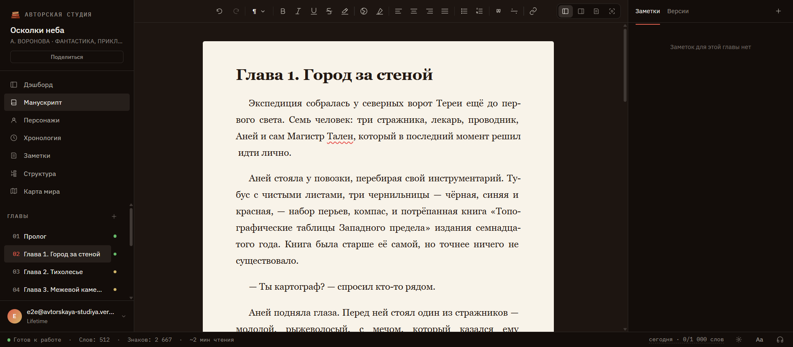
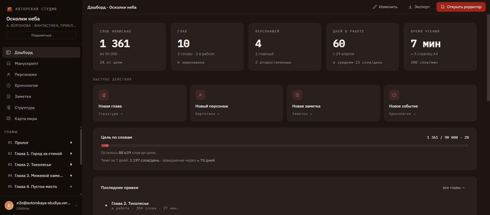
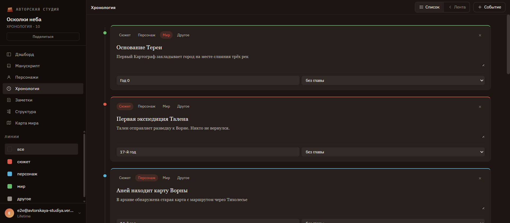
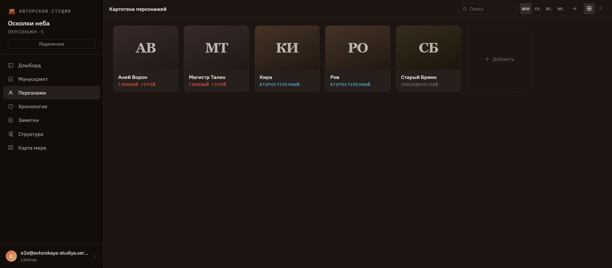
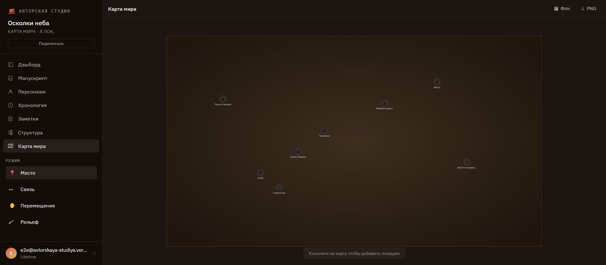

# Авторская студия

> Редактор для писателей: рукопись, картотека персонажей, карта мира, хронология — в одном тихом редакторе.

**Прод:** https://avtorstudio.com  
**Резервный:** https://avtorskaya-studiya.vercel.app

---

## Скриншоты


*Редактор: сайдбар с главами, rich-text поле, панель заметок и версий*

|  |  |
|---|---|
| Дашборд: статистика, прогресс, heatmap активности, ETA | Хронология: события по слоям (сюжет / персонаж / мир) |

|  |  |
|---|---|
| Картотека персонажей: роли, связи, поиск | Карта мира: локации, связи, шаблоны, штампы, экспорт PNG |

---

## Стек

| Слой | Технологии |
|---|---|
| Frontend | React 18, TypeScript (strict), Vite, Framer Motion |
| Редактор | TipTap (ProseMirror) |
| Backend / Auth | Supabase (Postgres + Auth + RLS + Edge Functions) |
| Оплата | Робокасса (СБП + карты), РобоЧеки СМЗ |
| Мониторинг | Sentry (ошибки + source maps) |
| Деплой — основной | Timeweb VPS, Ubuntu 24.04, Nginx, Let's Encrypt |
| Деплой — резервный | Vercel |
| CI/CD | GitHub Actions (build → rsync → reload) |
| DnD | @dnd-kit (сортировка глав, заметок, хронологии) |
| Экспорт | docx.js, JSZip (EPUB), XML (FB2), CSS @page (PDF) |

---

## Что реализовано

### Ядро редактора
- **Rich-text редактор** на TipTap: жирный, курсив, заголовки, списки, ссылки, выравнивание
- **4 режима вёрстки:** Студия / Левый / Правый / Страница
- **История версий** — снимки, diff между версиями, восстановление
- **Автосохранение** + горячие клавиши (Ctrl+S, Ctrl+Enter, Ctrl+F/N)
- **Outline** (дерево глав с drag & drop), **Corkboard** (карточки), **Focus** (полноэкранный), **Split** (два редактора)

### Структура произведения
- **Персонажи** — карточки, связи между персонажами, привязка к главам, псевдонимы, авто-детектирование упоминаний
- **Хронология** — события с типами и привязкой к главе, режимы «Список / Лента», drag & drop
- **Карта мира** — SVG-холст с zoom/pan, режимы «Место / Связь / Панорама / Штамп», загрузка фона, шаблоны карт, штампы рельефа (10 типов), экспорт PNG
- **Заметки** — 5 видов (идея, вопрос, todo, важно, пользовательский), drag & drop сортировка, привязка к главе

### Аккаунт и данные
- **Авторизация** — email/пароль, Telegram OAuth, VK ID 2.1, одношаговая регистрация
- **RLS-политики** — каждый пользователь видит только свои данные
- **Полка книг** — список, создание (название, жанр, цель по словам), загрузка обложки
- **Дашборд книги** — прогресс по словам, heatmap активности (GitHub-style), ETA завершения
- **Шаринг** — публичная ссылка для чтения книги (share_token)
- **Онбординг** — прогресс-чеклист для новых пользователей

### Экспорт и статистика
- **Экспорт** в DOCX / FB2 / EPUB / PDF / HTML / Markdown / TXT с настройкой стиля абзацев
- **StatusBar** — дневной прогресс, серия дней, ambient sounds, шрифт редактора

### Монетизация
- **Тарифы** — Free / Pro (месяц/год) / Lifetime
- **Оплата** через Робокассу (СБП + карты), рекуррентные списания
- **Возвраты** — автоматические через op_key
- **Отмена подписки** — с сохранением доступа до конца периода

### Платформа
- **Мобильный адаптив** — редактор, дашборд, персонажи, хронология, карта, навигация
- **Offline-баннер** — уведомление при потере сети
- **Admin-панель** `/admin` — DAU/WAU/MAU, retention, топ-10, управление пользователями, планами, feature flags, audit log, revenue-метрики
- **Лендинг** — публичная страница с тарифами и FAQ
- **Юридические страницы** — `/privacy`, `/terms`, `/offer`

---

## Архитектура

```
src/
  components/        — Chrome, Sidebar/*, EditorHybrid, RichEditor, EditorToolbar, RightPanel, StatusBar, WorldMap, BookCard, Icon, AuthForm, admin/* и др. (70+ файлов)
  pages/             — Auth, Home, Dashboard, Editor, Focus, Split, Outline, Corkboard, Map, Timeline, Characters, Notes, Export, Admin, Landing, Offer, ShareBook, ResetPassword, Privacy, Terms, NotFound
  lib/               — supabase-клиент, AuthProvider, React Query хуки, mutation-хуки, экспорт, утилиты (60+ файлов)
  styles/            — design-system.css (CSS-переменные oklch, классы .as, .btn, .input и др.)
  App.tsx            — роутер
supabase/migrations/ — SQL-миграции
deploy/              — nginx.conf, GitHub Actions workflow
```

---

## Деплой

**Основной (VPS):** push в `main` → GitHub Actions → `npm run build` → rsync в `/var/www/avtorstudio/dist/`. Nginx + SSL (Let's Encrypt). Supabase-запросы проксируются через `/sb/` на том же домене.

**Резервный (Vercel):** push в `main` → авто-деплой. `vercel.json` содержит SPA-fallback для React Router.

---

## Быстрый старт

```bash
npm install
cp .env.example .env
# Заполни VITE_SUPABASE_URL и VITE_SUPABASE_ANON_KEY
npm run dev   # http://127.0.0.1:5273
```

Миграции: применить SQL-файлы из `supabase/migrations/` по порядку нумерации через Supabase SQL Editor.

## Скрипты

```bash
npm run dev        # dev-сервер
npm run build      # продакшен-сборка в dist/
npm run preview    # превью сборки
npm run typecheck  # TypeScript без сборки
npm run lint       # ESLint
```

---

## AI-assisted development

Проект разрабатывается с применением **Claude Code** — AI-инструмента для разработки в терминале. Это означает, что часть кода написана при участии AI-ассистента, аналогично тому, как команды используют GitHub Copilot или Cursor.

Архитектурные решения, продуктовые приоритеты, UX-решения и код-ревью — на стороне разработчика. Claude Code используется как мультипликатор скорости, а не как замена пониманию кода.

Если вы рекрутер или ревьюер — готов объяснить любую часть кода на интервью.
